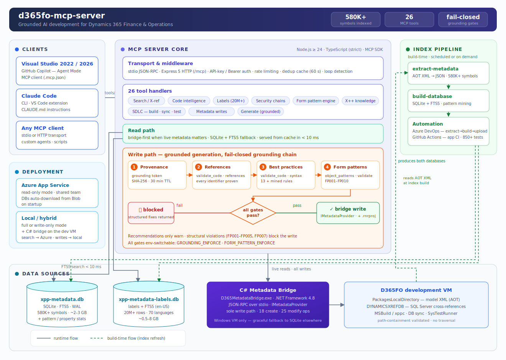
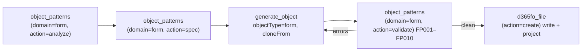

# D365 F&O MCP Server

<div align="center">

**26 AI tools that know every X++ class, table, form, and EDT in your D365FO codebase**

[](https://www.npmjs.com/package/d365fo-mcp)
[](https://opensource.org/licenses/MIT)
[](https://nodejs.org/)
[](https://www.typescriptlang.org/)
[](docs/TESTING.md)
<!-- coverage-badge:start -->
[](eval/COVERAGE.md) [](eval/COVERAGE.md)
<!-- coverage-badge:end -->

*Grounded AI development for Dynamics 365 Finance & Operations — works with GitHub Copilot and Claude Code*

</div>

---

## Why

AI assistants excel at C#, Python, and JavaScript. X++ is different: your D365FO codebase is private, deeply customized, and invisible to every model — so AI confidently generates code that doesn't compile.

This server pre-indexes your entire D365FO installation (580 000+ symbols across standard, ISV, and custom models) and exposes it as 26 specialized MCP tools. Every signature, every CoC wrapper, every label, every form pattern — verified against your real metadata **before** the AI writes a single line.



| Task | Without this server | With this server |
|------|--------------------|------------------|
| Method signatures | Guessed → compile errors | Exact, from your codebase |
| Existing CoC wrappers | Manual AOT search | `extension_info(mode="coc")` in < 50 ms |
| New forms | Hand-written XML, broken patterns | Cloned from reference forms, validated against the pattern catalog |
| Labels | Hardcoded strings | Right `@SYS`/`@MODULE` key found instantly |
| Security chains | Hours of manual tracing | Role → Duty → Privilege → Entry Point in one call |
| Generated code | Hallucinated fields and types | Every reference proven against the index, gated before write |

---

## Capabilities

| Feature | Description |
|---|---|
| 🔍 **Full-codebase intelligence** | 580K+ symbols indexed: classes, tables, forms, EDTs, enums, labels (20M+ rows), security artifacts — FTS5 search in < 10 ms |
| 🛡️ **Grounded generation** | Fail-closed gates: `prepare` issues grounding tokens, `validate_code(mode="references")` proves every identifier, `validate_code(mode="syntax")` enforces best practices — hallucinated code never reaches disk |
| 🧩 **Form pattern engine** | Complete catalog of Microsoft form patterns and sub-patterns: recommends the right pattern, clones reference forms with datasource re-binding, **deterministically expands** patterns that have no reference form, **auto-repairs** a form's missing required controls, validates structure and blocks invalid writes |
| ✍️ **Safe metadata writes** | C# bridge uses Microsoft's own `IMetadataProvider` — no string-replacement XML corruption, automatic `.rnrproj` registration, one-call undo |
| 🏗️ **SDLC integration** | MSBuild compilation with structured diagnostics, DB sync, xppbp best practices, SysTestRunner — all from chat |
| 📐 **X++ knowledge base** | Queryable rules: select grammar, CoC authoring, financial dimensions, the posting engine (`LedgerVoucher`), number sequences, `SysExtension`, Electronic Reporting, AX2012→D365FO migration — prevents deprecated APIs |

### Pattern-grounded form development

Forms are the hardest artifact to generate correctly — each pattern dictates required containers, ordering, and allowed sub-patterns. The form pattern engine makes it a guided pipeline:



Structural violations (wrong order, missing container, disallowed control) **block the write** — recommendations only warn. Mined pattern statistics from your own environment ground every suggestion in reality.

---

## Quick Start

Two entry points, depending on whether a server already exists:

```powershell
# Your team already runs one — connects your editor, nothing installed
npx d365fo-mcp connect https://your-server.azurewebsites.net

# Setting up your own D365FO VM — installs prerequisites, clones, runs the wizard
irm https://raw.githubusercontent.com/dynamics365ninja/d365fo-mcp-server/main/install.ps1 | iex
```

Both paths in full — prerequisites, editor configuration for every scenario, the required instruction file, and how to verify grounding actually works: **[docs/QUICK_START.md](docs/QUICK_START.md)**

---

## Azure Deployment

One shared instance for the whole team — the metadata index lives in Blob Storage and downloads automatically on startup.

[](https://portal.azure.com/#create/Microsoft.Template/uri/https%3A%2F%2Fraw.githubusercontent.com%2Fdynamics365ninja%2Fd365fo-mcp-server%2Frefs%2Fheads%2Fmain%2Finfrastructure%2Fazuredeploy.json)

Deployment guide: [docs/SETUP_AZURE.md](docs/SETUP_AZURE.md) · CI/CD automation: [docs/PIPELINES.md](docs/PIPELINES.md)

---

## Documentation

| Getting started | Reference | Operations |
|-----------------|-----------|------------|
| [Quick Start](docs/QUICK_START.md) — connect or install | [All 26 tools](docs/MCP_TOOLS.md) | [Azure deployment](docs/SETUP_AZURE.md) |
| [Setup scenarios A–F](docs/SETUP.md) | [`.mcp.json` reference](docs/MCP_CONFIG.md) | [DevOps pipelines](docs/PIPELINES.md) |
| [Claude Code setup](docs/CLAUDE_CODE_SETUP.md) | [Architecture](docs/ARCHITECTURE.md) | [Testing](docs/TESTING.md) |
| [Usage examples](docs/USAGE_EXAMPLES.md) — real tool chains | [C# Bridge](docs/BRIDGE.md) | [Custom / ISV models](docs/CUSTOM_EXTENSIONS.md) |
| | [Workspace detection](docs/WORKSPACE_DETECTION.md) | [SQLite vs Bridge](docs/SQLITE_DEPENDENCY.md) |
| | [Backlog](docs/BACKLOG.md) — deferred work & ideas | [Coverage](eval/COVERAGE.md) — what the badge counts |

## License

MIT
