# Architecture Overview

This document provides visual diagrams and detailed explanations of the D365 F&O MCP Server architecture.

## Table of Contents

1. [High-Level Architecture](#high-level-architecture)
2. [Request Flow](#request-flow)
3. [Component Architecture](#component-architecture)
4. [Data Flow](#data-flow)
5. [Deployment Architecture](#deployment-architecture)
6. [Database Schema](#database-schema)

---

## High-Level Architecture

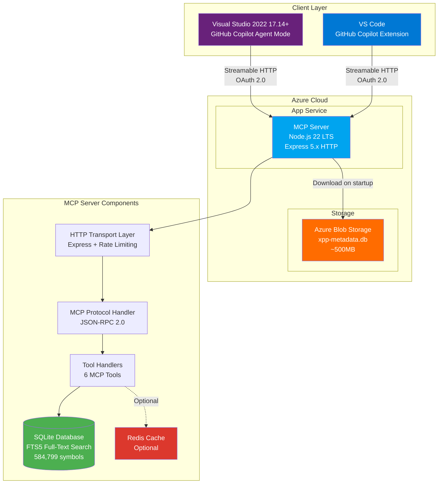

---

## Request Flow

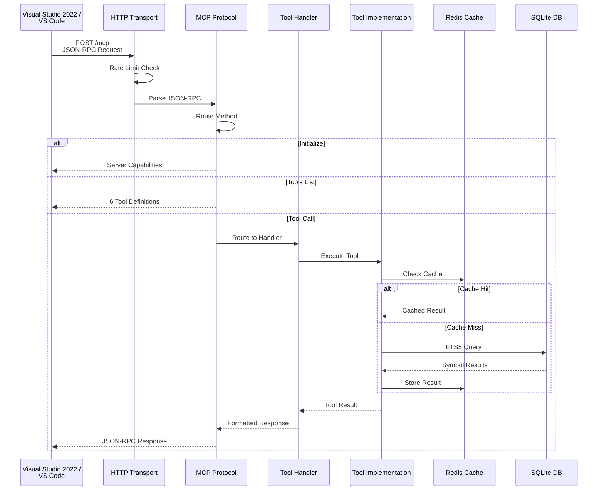

---

## Component Architecture

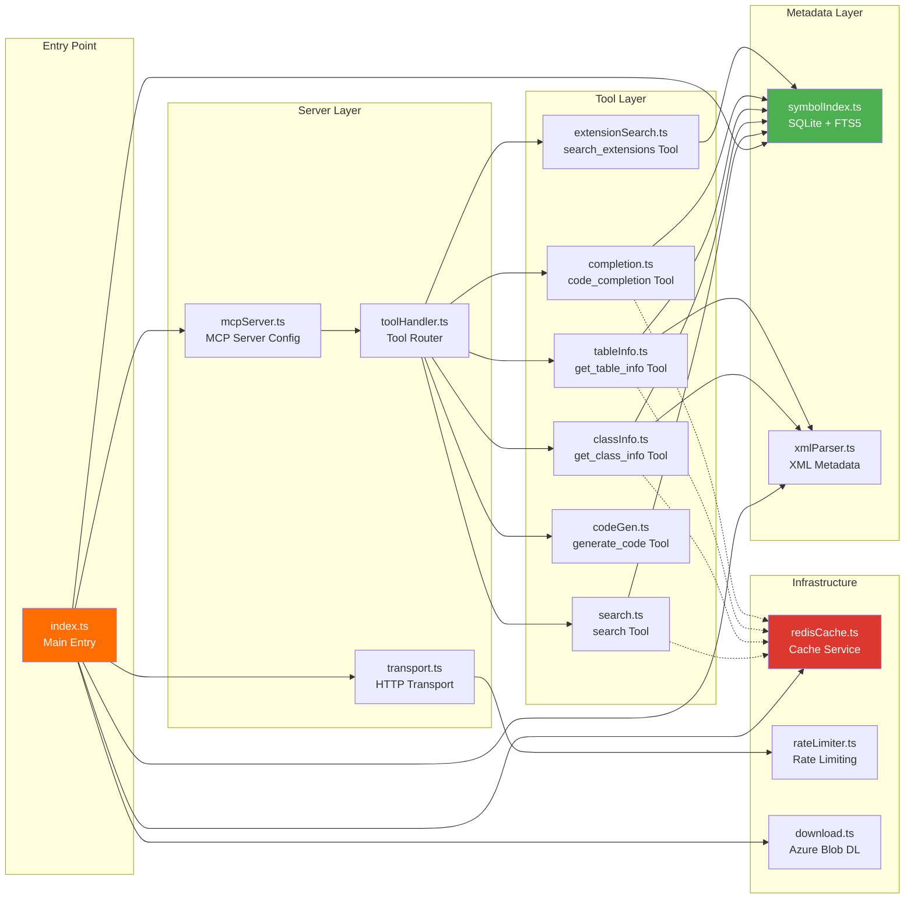

---

## Data Flow

### 1. Startup Flow

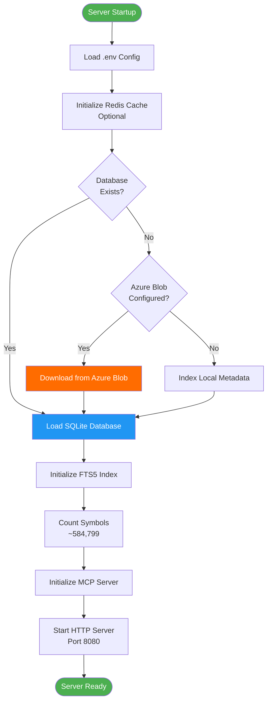

### 2. Search Query Flow

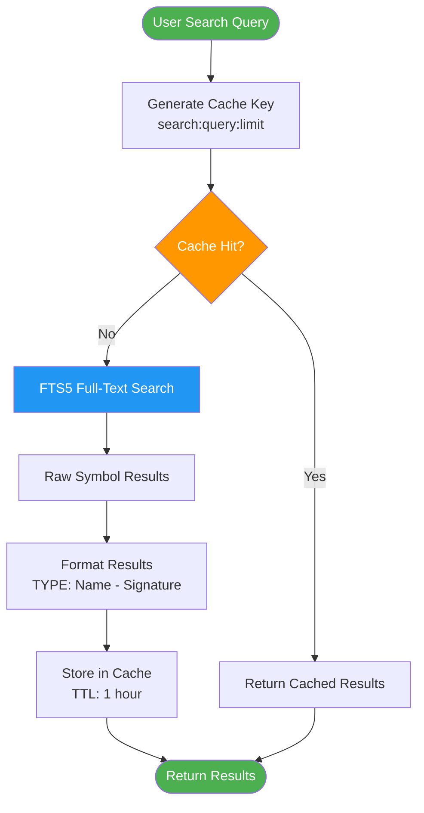

### 3. Class Info Query Flow

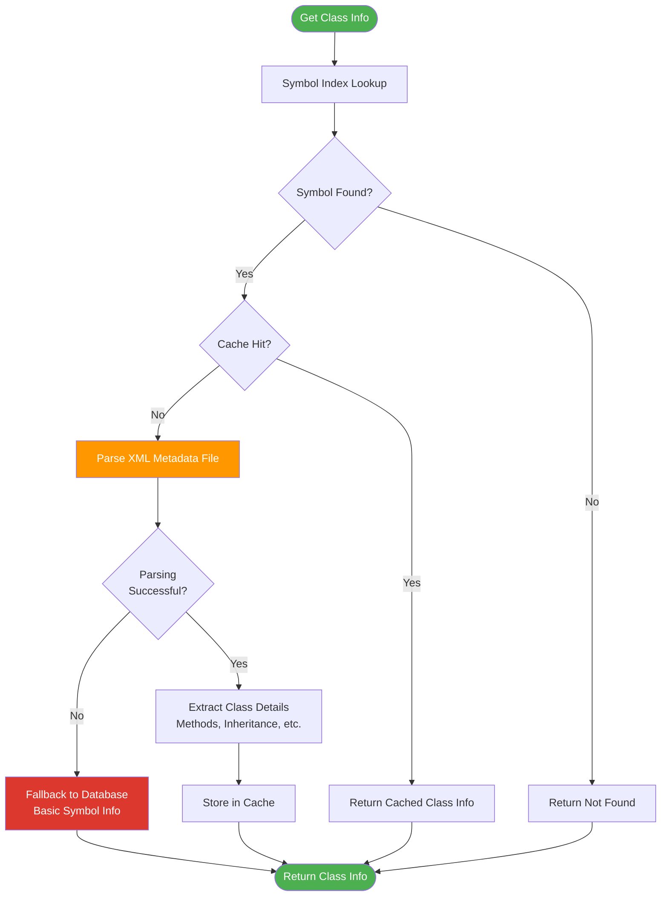

---

## Deployment Architecture

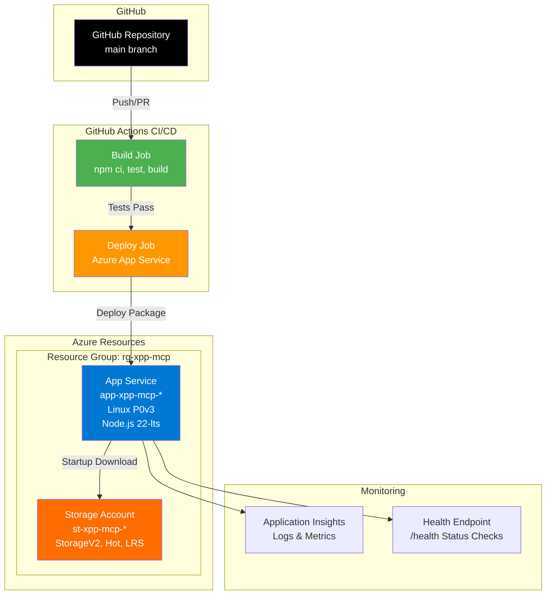

---

## Database Schema

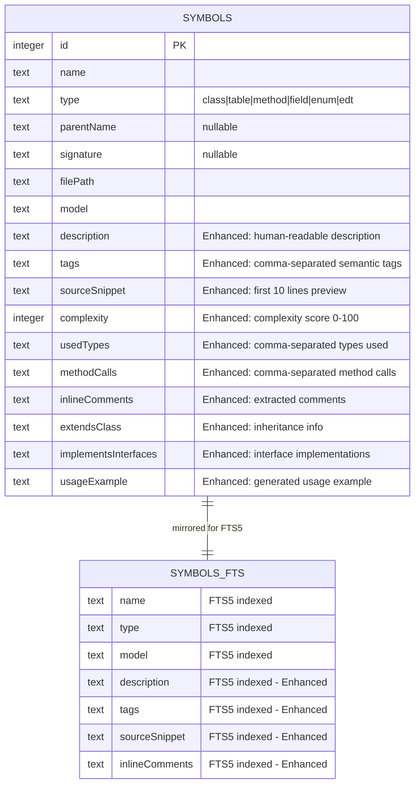

### Symbol Types

| Type | Description | Example |
|------|-------------|---------|
| `class` | X++ Class | `CustTable`, `SalesLine` |
| `table` | AOT Table | `CustTable`, `InventTable` |
| `method` | Class/Table Method | `insert()`, `validateWrite()` |
| `field` | Table Field | `AccountNum`, `Name` |
| `enum` | Enumeration | `NoYes`, `TransactionType` |
| `edt` | Extended Data Type | `CustAccount`, `ItemId` |

### Enhanced Metadata Fields

The database now includes rich contextual metadata for better GitHub Copilot integration:

| Field | Type | Description | Example |
|-------|------|-------------|---------|
| `description` | TEXT | Human-readable description | "CustTable class extending SalesTable" |
| `tags` | TEXT | Semantic tags (comma-separated) | "validation, query, customer" |
| `sourceSnippet` | TEXT | First 10 lines of code | "public boolean validate() {...}" |
| `complexity` | INTEGER | Complexity score (0-100) | 45 |
| `usedTypes` | TEXT | Referenced types | "CustTable, SalesLine, InventTable" |
| `methodCalls` | TEXT | Called methods | "select, insert, validateWrite" |
| `inlineComments` | TEXT | Extracted comments | "Validate customer account..." |
| `extendsClass` | TEXT | Parent class (for classes) | "FormRun" |
| `implementsInterfaces` | TEXT | Interfaces implemented | "Runnable, Serializable" |
| `usageExample` | TEXT | Generated usage example | "CustTable custTable = new..." |

### Semantic Tags

Automatically extracted tags help Copilot understand code context:

**Method Tags:** validation, initialization, data-modification, query, deletion, calculation, conversion, event-handler, transaction, error-handling, database-query, set-based, loop, conditional, async, static-method

**Class Tags:** controller, utility, business-logic, builder-pattern, factory-pattern, event-handler, abstract, final, runnable

**Domain Tags:** customer, vendor, inventory, sales, purchasing, ledger, tax, project, warehouse, production

### Indexes

```sql
-- Primary Key
CREATE UNIQUE INDEX idx_symbols_id ON symbols(id);

-- Type-based queries
CREATE INDEX idx_symbols_type ON symbols(type);

-- Name lookups
CREATE INDEX idx_symbols_name ON symbols(name);

-- Model filtering
CREATE INDEX idx_symbols_model ON symbols(model);

-- Unique constraint to prevent duplicates
CREATE UNIQUE INDEX idx_symbols_unique 
    ON symbols(name, type, COALESCE(parent_name, ''), model);

-- Full-Text Search (FTS5) with enhanced fields
CREATE VIRTUAL TABLE symbols_fts USING fts5(
    name, type, parent_name, signature,
    description, tags, source_snippet, inline_comments,
    content='symbols',
    content_rowid='id'
);
```

---

## MCP Protocol Endpoints

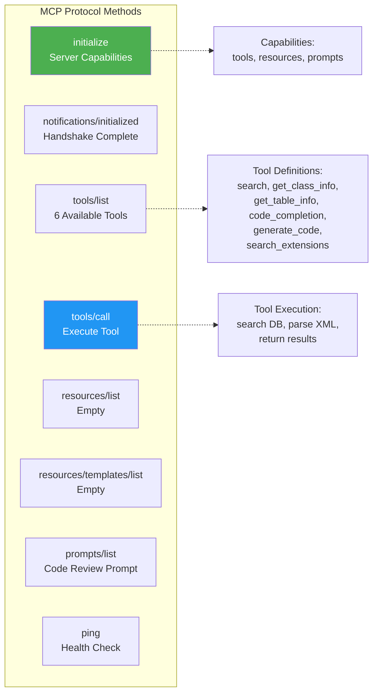

### Tool Arguments & Responses

#### 1. search
**Input:**
```json
{
  "query": "CustTable",
  "type": "all",
  "limit": 20
}
```

**Output:**
```
Found 5 matches:

[TABLE] CustTable
[METHOD] CustTable.insert - boolean insert()
[FIELD] CustTable.AccountNum - str AccountNum
```

**Type Filter Options:** `class`, `table`, `field`, `method`, `enum`, `all`

#### 2. get_class_info
**Input:**
```json
{
  "className": "CustTable"
}
```

**Output:** Markdown-formatted class details with methods, inheritance, modifiers

#### 3. get_table_info
**Input:**
```json
{
  "tableName": "CustTable"
}
```

**Output:** Markdown-formatted table schema with fields, indexes, relations

#### 4. code_completion
**Input:**
```json
{
  "objectName": "CustTable",
  "prefix": "set"
}
```

**Output:** List of matching methods starting with "set"

#### 5. generate_code
**Input:**
```json
{
  "pattern": "batch-job",
  "name": "MyBatch"
}
```

**Output:** X++ code template for batch job

#### 6. search_extensions
**Input:**
```json
{
  "query": "Cust",
  "prefix": "ISV_"
}
```

**Output:** Search results filtered to custom/ISV models only

---

## Performance Optimizations

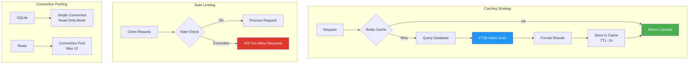

### Caching TTLs

| Cache Type | TTL | Rationale |
|------------|-----|-----------|
| Search Results | 1 hour | Metadata rarely changes |
| Class Info | 1 hour | Static AOT metadata |
| Table Info | 1 hour | Static AOT metadata |
| Completions | 30 min | Frequently accessed |
| Extension Search | 30 min | Less frequent updates |

### Rate Limits

| Endpoint | Limit | Window |
|----------|-------|--------|
| `/mcp` | 100 requests | 15 minutes |
| `/health` | 1000 requests | 15 minutes |

---

## Security Architecture

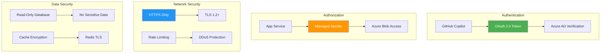

---

## Error Handling Flow

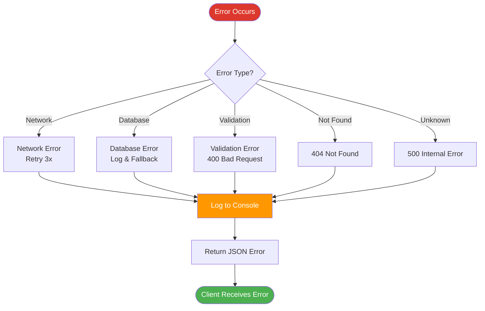

### Error Response Format

```json
{
  "jsonrpc": "2.0",
  "id": 123,
  "error": {
    "code": -32600,
    "message": "Invalid Request",
    "data": {
      "detail": "Missing required parameter: className"
    }
  }
}
```

---

## Scalability Considerations

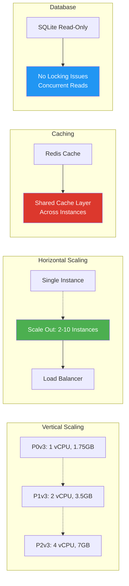

### Current Capacity

- **Storage:** 500MB database (584,799 symbols)
- **Memory:** 1.75GB (P0v3) - ~800MB used
- **Throughput:** 100 req/15min per IP
- **Latency:** 
  - Cache hit: <10ms
  - Cache miss: 50-200ms
  - Cold start: 15-30s (database download)

---

## Testing Architecture

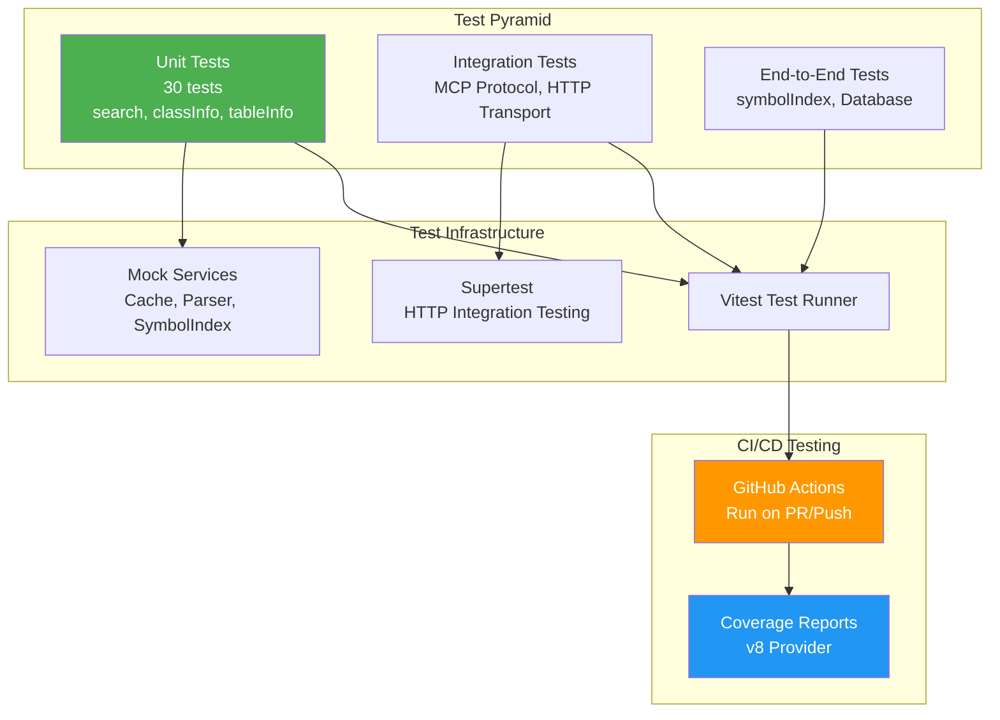

---

## Technology Stack

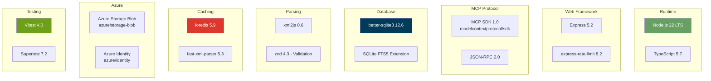

---

## Future Enhancements

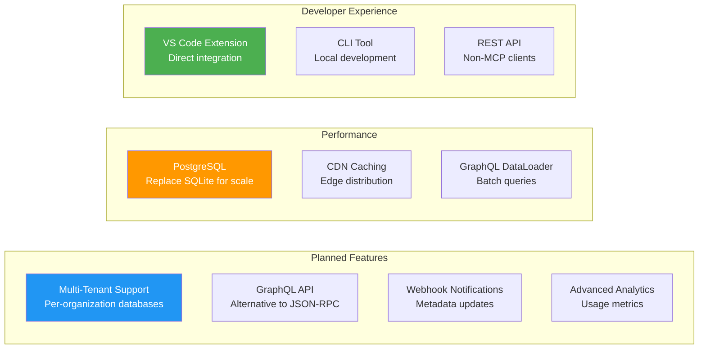

---

## Conclusion

This architecture provides:

✅ **High Performance** - FTS5 full-text search with Redis caching  
✅ **Scalability** - Stateless design, horizontal scaling ready  
✅ **Reliability** - Error handling, rate limiting, health checks  
✅ **Security** - OAuth 2.0, HTTPS, Managed Identity  
✅ **Maintainability** - TypeScript, comprehensive tests, CI/CD  
✅ **Cost-Effective** - Serverless Azure App Service, efficient caching  

The modular design allows for easy extension and adaptation to different D365 F&O environments while maintaining compatibility with the MCP protocol standard.
